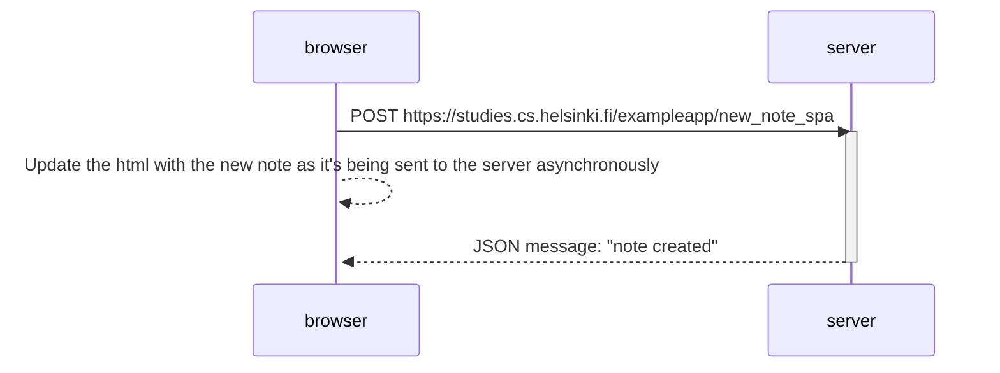

```mermaid
sequenceDiagram
    participant browser
    participant server
    
    browser->>server: POST https://studies.cs.helsinki.fi/exampleapp/new_note_spa
    activate server
    activate browser
    browser-->>browser: Update the html with the new note as it's being sent to the server asynchronously
    server-->>browser: JSON message: "note created"
    deactivate server
```