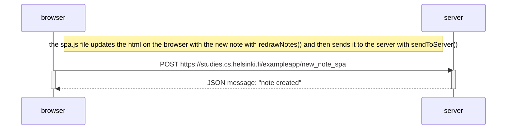

```mermaid
sequenceDiagram
    participant browser
    participant server
    
    Note right of browser: the spa.js file updates the html on the browser with the new note with redrawNotes() and then sends it to the server with sendToServer()
    browser->>server: POST https://studies.cs.helsinki.fi/exampleapp/new_note_spa
    activate server
    activate browser
    server-->>browser: JSON message: "note created"
    deactivate server
    deactivate browser
```